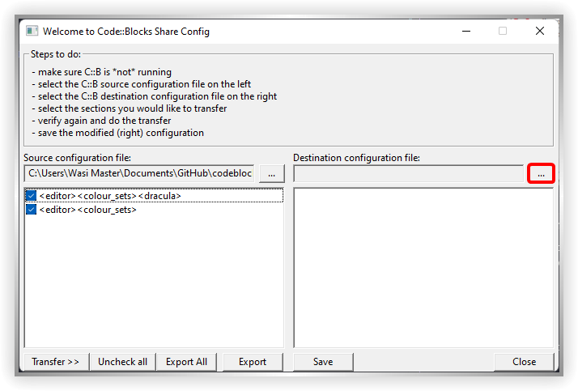

### [Code::Blocks](https://www.codeblocks.org/)

#### To Install

- Download the [dracula.conf file](https://raw.githubusercontent.com/dracula/codeblocks/master/dracula.conf).
<!-- - Download the [dracula.conf file](https://draculatheme.com/codeblocks/dracula.conf). -->
- Open Codeblocks share config
    - **Windows**
        - Open `C:\Program Files\CodeBlocks\cb_share_config.exe` depending on where you installed codeblocks
        - Or you can Go to start (Press <kbd>⊞ Win</kbd>) then type "Codeblocks Share Config"
        - Run the application by pressing <kbd>↵ Enter</kbd> or clicking on it's icon with the mouse
    - **Linux**
        - Open `~/.codeblocks/cb_share_config` depending on where you installed codeblocks, you may also want to run it as sudo
    - **MacOS**
        - Open `/Applications/CodeBlocks.app/Contents/MacOS/cb_share_config`
- Click the <kbd>...</kbd> button under "Source configuration file"

    
    <!--  -->
    <!--  -->

- Navigate to where you downloaded the `dracula.conf` file, it will be most likely in the downloads folder

- Click the two check boxes that appear
    
    <!--  -->
    <!--  -->

- Click the <kbd>...</kbd> button under "Destination configuration file"

    
    <!--  -->
    <!--  -->
- Navigate to the `default.conf` file of Codeblocks, the location will differ by OS, If you can't find it, you should try creating a new project so that it gets created again.
    - **Windows**
        - The location in Windows is `C:/Users/<User Name>/AppData/Roaming/Codeblocks/default.conf` (`%APPDATA%/Codeblocks/default.conf`)
        - The AppData folder is by default hidden by Windows Explorer.
            - On Windows 10, Go to the "View" tab at the top and check the "Hidden items" checkbox
            - On Windows 11, Click the "View" icon at the top then hover over "Show" and check the "Hidden items" checkbox
    - **Linux**
            - The location in Linux is `~/.config/codeblocks/default.conf`
    - **MacOS**
        - The location in MacOS is `~/Library/Application Support/codeblocks/default.conf`
        - The Library folder is by default hidden by the most recent version of Mac OS. You could use <kbd>⌘ Command + ⇧ Shift + G</kbd> to navigate to hidden folders.
- Now click on the <kbd>Transfer >></kbd> Button

    
    <!--  -->
    <!--  -->

- Click <kbd>Yes</kbd>

    
    <!--  -->
    <!--  -->

- Then you'll see a message like this, press <kbd>Ok</kbd>

    
    <!--  -->
    <!--  -->

- Then press <kbd>Save</kbd> and voilà, you've just installed the theme

#### Activating theme

The theme should be automatically applied, if not, Go to `Settings` then `Editor` then `Syntax Highlighting` and set the `Colour Theme` to `dracula`

You should also change your cursor color to white

- Click Settings

    
    <!--  -->
    <!--  -->

- Click <kbd>Margins and caret</kbd>

    
    <!--  -->
    <!--  -->

- Click on the color

    
    <!--  -->
    <!--  -->

- Click the white color on the bottom right

    
    <!--  -->
    <!--  -->
