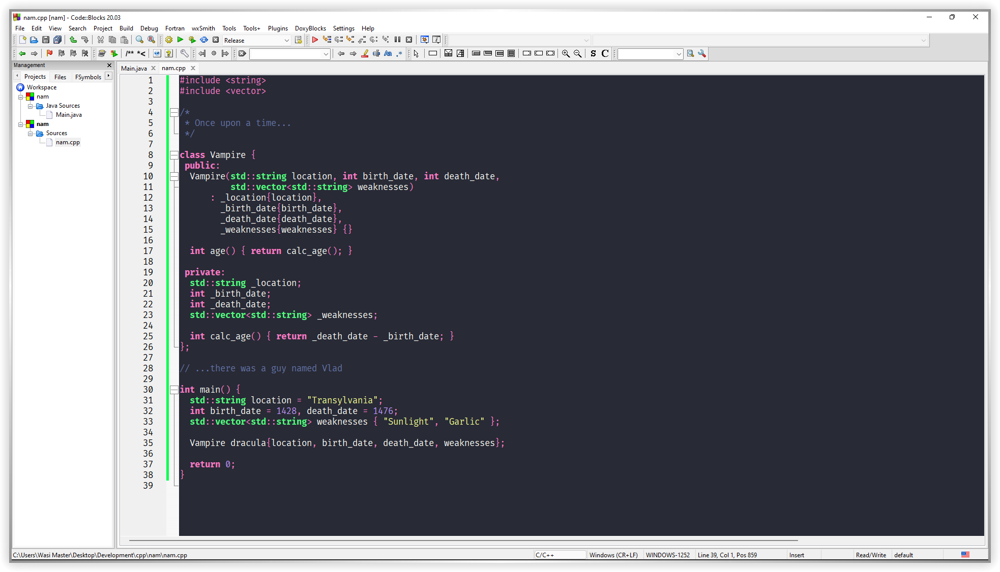

# Dracula for [Code::Blocks](https://www.codeblocks.org/)

> A dark theme for [Code::Blocks](https://www.codeblocks.org/).

## Install

All instructions can be found at [INSTALL.md](https://github.com/wasi-master/codeblocks/blob/master/INSTALL.md).
<!-- All instructions can be found at [draculatheme.com/codeblocks](https://draculatheme.com/codeblocks). -->

## Team

This theme is maintained by the following person(s) and a bunch of [awesome contributors](https://github.com/wasi-master/codeblocks/graphs/contributors).
<!-- This theme is maintained by the following person(s) and a bunch of [awesome contributors](https://github.com/dracula/codeblocks/graphs/contributors). -->

 |
--- |
[Wasi Master](https://github.com/wasi-master) |

## License

[MIT License](./LICENSE)